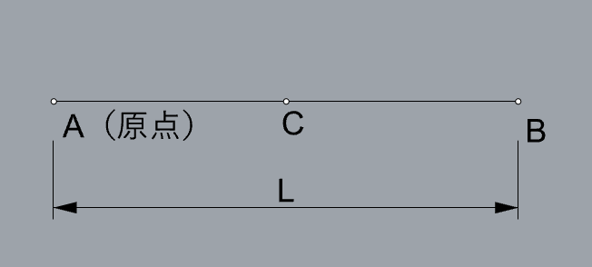

# 演習1（構造）
## 単純梁の解析
以下のような単純梁をGrasshopper + Karamba3Dで解析します。

***
## Grasshopperによる描画

以下の条件でgh状で節点及び線を描画します。

点A　原点（ 0, 0, 0 )

点B　　　（ L, 0, 0 )

点C　AB間の中心（ L / 2, 0, 0 )

スパンLはNumberSliderでパラメーターとして設定します。

***
## コンポーネントの配置例

以下に配置例を示します。

使用コンポーネント

・Panel

・Division(Maths → Opeators)

・Number Slider(Params → Input)

・Construction Point(Vector → Point)

・Line(Curve → Primitive)

***
## Karamba3Dによる解析

1.支点（境界条件）の設定

2.梁要素の設定

3.断面形状の定義（H形鋼）

4.材料の定義（鉄骨）

5.分布荷重の設定

6.解析モデルの構築

7.解析

8.出力（モデル及び梁要素）

使用コンポーネント

・Support(Karamba3D → Model)

・LineToBeam(Karamba3D → Model)

・Cross Section(Karamba3D → Cross Section)

・Materials(Karamba3D → Materials)

・Assemble(Karamba3D → Algorithms)

・Analyze(Karamba3D → Algorithms)

・Model View(Karamba3D → Results)

・Beam View(Karamba3D → Results)
