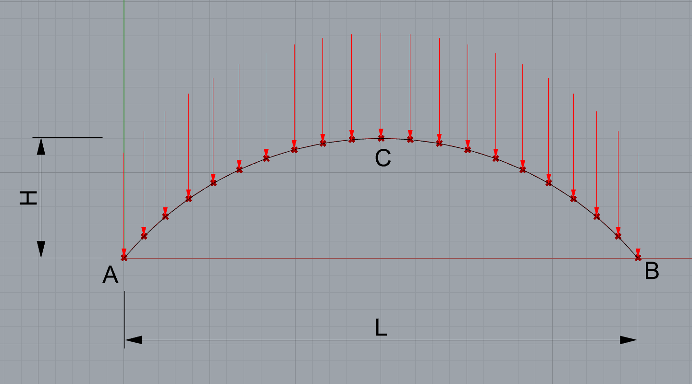
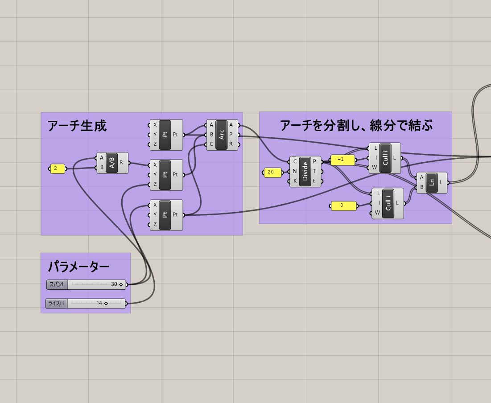
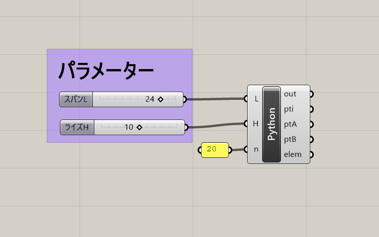
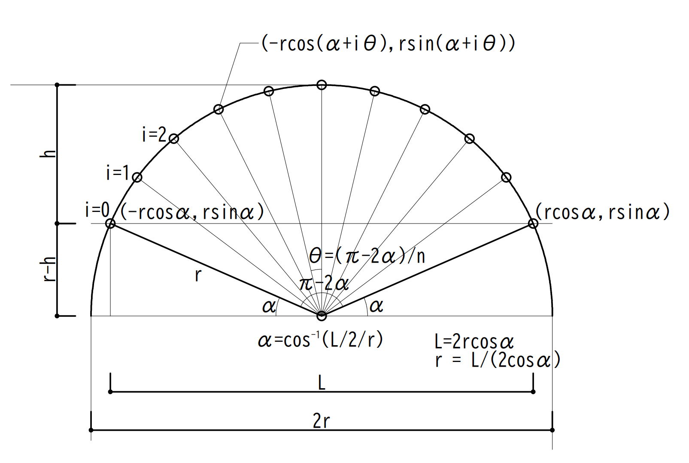

# 演習2

## 1.演習課題
アーチ構造を解析し、構造部材に作用する応力度を計算します。


### 架構形状
支点をA、Bとし、スパンをL、ライズをHとした以下のアーチ構造をモデル化します。A・C・Bは円弧による曲線とし、円弧ACB上を20分割した節点間を線分で結びます。
入力パラメーターは以下の２つとしてください。

・スパンL( 20 < L <= 50m ) 

・ライズH( 10 < H <= 25m ) 

### 荷重

各節点(21点)に集中荷重40kN(下向き)

### 断面及び材料

断面寸法は任意で構いませんが、例として以下のものを設定します。

O - 400 x 12（直径400mm、板厚12mmの円形鋼管）

(断面積 A=146.3cm<sup>2</sup>, 断面係数Zy=1378cm<sup>3</sup>, 断面二次モーメントIy=27552cm<sup>4</sup>)

材料 SN400
(E=205000N/mm<sup>2</sup>, 長期許容応力度f=156N/mm<sup>2</sup>)

### 支点条件

点A・Bともに水平方向は固定、回転方向は自由とします。



以下に解答例を示しますが、極力自分でコンポーネントを考えて配置してみましょう。

## 2.Grasshopperによる描画

### 2.1 コンポーネントによる描画例

STEP1) Grasshopper上で円弧ACBを描画します。


STEP2) 円弧ACBをn等分して節点位置を求め、各節点間を直線で結びます。

節点はリストとして格納されていますので、i番目の節点とi+1番目の節点をつなげることが必要となります。

いくつか方法はありますが、二つの節点リスト(21個)を用意し、片方は最初の点を削除し、もう一方は最後の点を削除して、リスト同士を直線で結びます。

この直線が解析する要素になります。




### 2.2 ghPythonによる描画例

ghpythonを用いて描画した場合



```python
import rhinoscriptsyntax as rs

crdA = (0,   0, 10) # 始端座標
crdB = (L,   0, 10) # 終端座標
crdC = (L/2, 0, 10+H) # 終端座標

# 円弧の描画
arc = rs.AddArc3Pt(crdA, crdB, crdC) 
# 円弧の分割(ptiは節点が格納されたリスト)
pti = rs.DivideCurve(arc, n) 

ptA = pti[ 0] # 始端
ptB = pti[-1] # 終端（リストの最後は-1取り出せる）

# 節点i-節点i+1を直線で結び、リストelemに格納
elem = []
for i in range( len(pti)-1 ):
    elem.append( rs.AddLine( pti[i], pti[i+1] ) )
```

rhino-pythonを用いて描画した場合（幾何計算）



1. 幾何条件L,hよりrを求める
   
   L<sup>2</sup>/4+(r-h)<sup>2</sup>=r<sup>2</sup> → r=(L<sup>2</sup>/4+h<sup>2</sup>)/2h

2. rcosα=L/2よりαを求める
   
3. π-2αをn等分してi番目の節点座標を求める

※原点を基点に計算しているので、y座標をr-h引く必要があります。

```python
import rhinoscriptsyntax as rs
import math

n = int(n) # nを整数に変換
r =  ( L**2/4 + H**2 ) / 2/H # 円弧の半径rを算出
ar = math.asin( (r-H)/r ) 
th = ( math.pi- 2*ar ) / n

# 円弧上の点の計算
pti = [] # 節点（座標ではなくてジオメトリ）を格納するリスト
for i in range(n+1):
    x = L / 2 - r *math.cos(ar + i*th) 
    z = r * math.sin(ar + i*th)- r + H
    pti.append(rs.AddPoint(x, 0, z))

ptA = pti[ 0] # 始端
ptB = pti[-1] # 終端（リストの最後は-1取り出せる）

# 線分の描画
elem = [] # 要素（ジオメトリ）を格納するリスト 
for i in range(n):
    # ジオメトリから節点座標を取り出す
    ps = rs.PointCoordinates(pti[i]) 
    pe = rs.PointCoordinates(pti[i+1])
    elem.append(rs.AddLine(ps,pe))
```

## 3.Karamba3Dによる解析
前回と同様に、Karambaの各コンポーネントを接続し、解析を実行し、My(y軸周り曲げモーメント)とNx(軸力)を図化します。ライズを調整することで部材に生じるMyやNxがどのように変化するか確認してください。
また、解析結果が想定と間違っていないか検証を行ってください。


なお、各要素に生じる応力度（単位面積当たりの力）は下式であらわされます。


ライズを調節することで各要素に生じる最大応力度が小さくなるライズを探してみてください。

以下は接続例です。


なお、N/A+M/Zの計算は関数を定義して計算しています。
Maths　-> script -> Evaluate

単位に注意して各自設定してください。

## 4.断面性能の計算について

Karamba3DのCrossSectionで定義した断面はDissassemble CrossSectionで出力できます。

以下に主なものを示しておきます。

A 断面積(cm<sup>2</sup>)

A<sub>y</sub> y軸周りせん断断面積(cm<sup>2</sup>)

A<sub>z</sub> z軸周りせん断断面積(cm<sup>2</sup>)

I<sub>yy</sub> y軸周り断面二次モーメント(cm<sup>4</sup>)

I<sub>zz</sub> z軸周り断面二次モーメント(cm<sup>4</sup>)

W<sub>ely+</sub> y軸周り断面係数Zy(cm<sup>3</sup>)

W<sub>elz+</sub> z軸周り断面係数Zz(cm<sup>3</sup>)

W<sub>ply</sub> y軸周り塑性断面係数Zpx(cm<sup>3</sup>)

W<sub>plz</sub> z軸周り塑性断面係数Zpy(cm<sup>3</sup>)


