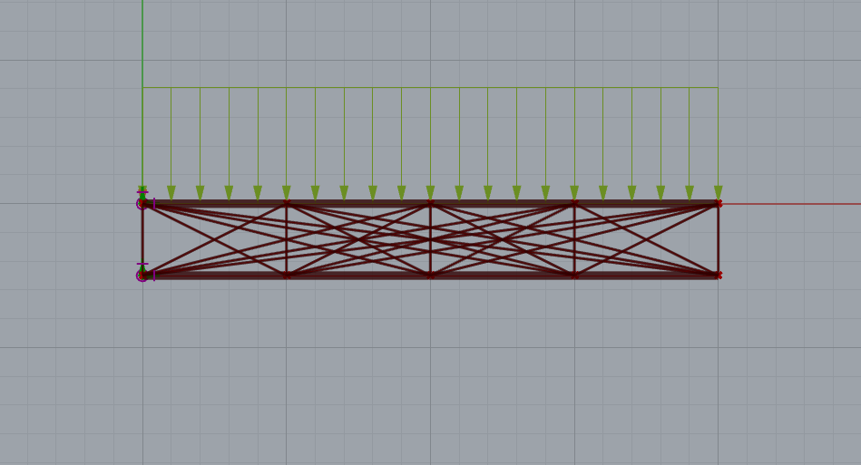
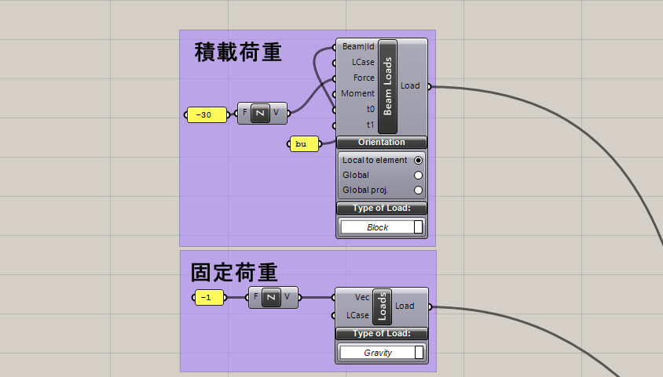

# デジタルエンジニアリング特論2022/5/26 構造演習3

※※ 現在作成中の講義資料です。時間を見つけて更新していきます。

## 最適化計算について

最適化計算とは、ある制約条件の中である目的関数を最小化もしくは最大化する設計変数を探索する事です。

例えば、第1回の課題の単純梁において、以下のような最適化問題を定義できます。

目的関数：鉄骨重量の最小化

設計変数：鉄骨断面寸法

制約条件：変形角1/250以下・長期許容応力度以下

このような単純な問題であればコンピューターに頼ることなく手計算でも計算可能です。

実際は構造設計の最適化における設計変数は多岐にわたり、無数といっても過言ではありません。
構造設計における最適化計算は古くからある技術ですが、最近でこそ大手ゼネコンや設計事務所が取り取り組み始めているものの、実務設計において本格的な最適化計算が行われるケースは極めて稀です。

現時点で実務で最適化計算を行おうとすれば、高価な最適化ツールを購入するか、自ら開発するかのどちらかしかありません。（近い将来ソフトメーカーからも販売されるものと思いますが、自由度はかなり限られると思います。）

今回紹介するgrasshopperにおける最適化計算は比較的容易ですが、限られた設計変数で、部分的な架構の検討では十分実用的なのですが、実務ベースでは速度的な問題が課題となります。

実施設計の中で限られたリソースと時間の中で最適化設計を行う際は、まず設計者の感覚・経験に基づいて設計変数を縮約することが重要です。

<!-- 構造設計における最適化計算には様々の種類が考えられます。
例えば、部材寸法の最適化、部材配置の最適化、架構形状の最適化などが想像がつきます。

最適化手法は様々な手法がありますが、今回はgrasshopperにプラグインとして用意されている遺伝的アルゴリズムを使用します。
遺伝的アルゴリズムのコンポーネントは標準で搭載されているGalapagosと -->

---
## 演習課題3(トラス梁の最適化計算)

長さ20mの片持ち梁の最適化を行います。上弦材及び下弦材の間の斜材及び束材の配置を最適化することで、梁の総重量を最小化します。

最大変形が変形角1/100以下(最大変形20cm以下)であることを条件とします。簡略化のため応力度については特に制限を設けません。

### 架構形状

基点

点A( 0.0, 0.0, 0.0)

点B(20.0, 0.0, 0.0)

先端

点C( 0.0, 0.0, -2.5)

点D(20.0, 0.0, -2.5)

上弦材はABを結ぶ直線、下弦材はACを結ぶ直線とし、上弦材・下弦材の断面は(********** SN490)とします。

AB間およびAC間をそれぞれ4等分し節点を設け、上弦材上の節点と下
弦材上の節点を総当たりで結んだ線を「下地」とし、このうち必要なものを斜材及び束材として使用します。斜材及び束材の断面は(********** SN490)とします。
各要素の端部は解析の簡略化のため全て剛接合とします。

### 支点

点A及び点Cについて、Tx,Ty,Tz及びRx,Ry,Rz全て固定します。

### 荷重

上弦材に分布荷重25kN/m下向きを作用させます。
また、すべての要素の自重を考慮することにします。

---

## 解答例

### コンポーネントの配置

コンポーネントの配置例の全体図を以下に示します。

#### 上弦材・下弦材の描画

・節点Aと節点Bを定義し、AB間を上弦材として描画します。DivideCurveコンポーネントでAB間を等分し、Shutterコンポーネントで直線も分割します。
下弦材は上弦材を2.5m下にMoveコンポーネントでコピーします。(grasshopperではMoveコンポーネントはMove前のジオメトリも残りますので、実質コピーとなります。)

#### 斜材・束材の描画

上弦材及び下弦材を分割した節点が格納されたデータのどちらの片方データをGraftしてLINEコンポーネントで結びます。そうすると上下の節点で総当たりの線が引けます。節点は5点ずつありますので、斜材・束材計25本線が引かれます。

#### 要素と荷重の定義

・上弦材・下弦材と斜材・束材で断面形状を変えますので、CrossSectionを2つ配置します。

分布荷重は上弦材のみに作用させますので、LineToBeamコンポーネントは上弦材用、下弦材用、斜材束材用の3つを配置します。

このうち上弦材のみに荷重を作用させるので、IDに名称を付けます。このIDは分布荷重にも同じIDをつけておきます。

#### 最適化

この例ではgrasshopper標準で搭載されているGarapagosというコンポーネントを使用します。
このコンポーネントでは遺伝的アルゴリズム(Genetic Algorithm 略称GA)及び焼きなまし法(Simulated Annealing 略称SA)による最適化計算を行うことが可能です。

斜材・束材配置の有無を設計変数とし、GenePoolコンポーネントを配置し、スイッチを25個に設定します。
斜材及び束材を格納したLINEをDispatchコンポーネントで紐づけます。このコンポーネントは0か1(BOOL値)の数値でジオメトリの有無を定義します。

架構重量はAssembleModelコンポーネントのWeight端子から取り出すことが可能です。
最大変形はAnalyzeコンポーネントのDisp端子から取り出します。GHPythonコンポーネントで、変形が許容値の10cmを超えたら重量を増やすようなペナルティを与えることで制約条件を満足させます。

