デジタルエンジニアリング特論2022/5/19 構造演習2

- [1. 演習課題](#1-演習課題)
  - [1.1. 架構形状](#11-架構形状)
  - [1.2. 支点（境界条件）](#12-支点境界条件)
  - [1.3. 荷重](#13-荷重)
  - [1.4. 設計目標](#14-設計目標)
  - [1.5. 断面及び材料](#15-断面及び材料)
- [2. Grasshopperによる描画](#2-grasshopperによる描画)
  - [2.1. コンポーネントによる描画例](#21-コンポーネントによる描画例)
  - [2.2. ghPythonによる描画例](#22-ghpythonによる描画例)
    - [2.2.1. rhino-pythonの描画機能を用いて描画した場合](#221-rhino-pythonの描画機能を用いて描画した場合)
    - [2.2.2. 幾何計算による場合](#222-幾何計算による場合)
- [3. Karamba3Dによる解析](#3-karamba3dによる解析)
- [4. 断面性能の計算について](#4-断面性能の計算について)
- [5. 最大応力度の計算](#5-最大応力度の計算)
- [6. パラメトリックスタディについて](#6-パラメトリックスタディについて)
  - [6.1. 連番で並んだ画像を動画にする](#61-連番で並んだ画像を動画にする)
  - [6.2. Karambaで解析した結果をCSVに出力する](#62-karambaで解析した結果をcsvに出力する)
  - [6.3. 出力されたCSVファイルをグラフに出力する](#63-出力されたcsvファイルをグラフに出力する)
    - [6.3.1. grasshopperによる出力](#631-grasshopperによる出力)
    - [6.3.2. pandasによる出力](#632-pandasによる出力)

# 1. 演習課題

アーチ構造を解析し、構造部材に作用する応力度や変形を計算します。
アーチのライズ比をパラメトリックに変更することによって、様々な解析結果がどの様に変化するか確認してください。

<!--  -->

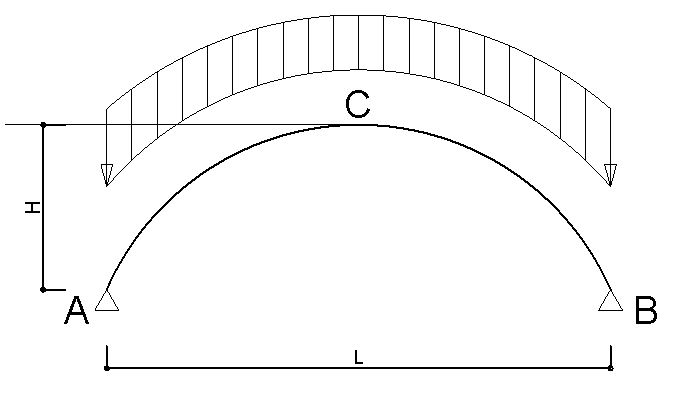

## 1.1. 架構形状

支点をA、Bとし、スパンL=40m、ライズをHとした以下のアーチ構造をモデル化します。A・C・Bは円弧による曲線とします。

入力パラメーターとしてライズH( 0 ≦ H ≦ 20m )を設定します。

## 1.2. 支点（境界条件）

点A・Bともに鉛直・水平方向は固定、回転方向は自由とします。（ピン支持）

Karamba3Dは3次元の骨組しかモデル化できないので、材軸方向及び面外方向の回転変形は拘束します。

## 1.3. 荷重

アーチが屋根荷重を負担する幅は20mとし、固定荷重1000N/m<sup>2</sup>、積雪荷重（積雪深さ30cm、雪の比重20N/cm/m<sup>2 </sup>）600N/m<sup>2 </sup>とします。

単位長さあたりの荷重は以下の通りです。

固定荷重20m x 1000N/m<sup>2 </sup>=20kN/m

雪荷重　20m x  600N/m<sup>2 </sup>=12kN/m

+ 雪荷重は屋根勾配に応じて低減することが可能ですが無視します。また緩勾配（15°以下）の場合は割り増しが必要ですが、これも無視します。
+ 今回は計算を簡略化するために、固定荷重1000N/m<sup>2 </sup>の中にアーチ部材の自重は含むものとします。
+ 固定荷重は要素単位長さあたりの荷重ですが、積雪荷重は投影長さあたりの荷重であることに注意してください。

<B>荷重が正しく入力されているか各自検証を行ってください。(重要)</B>

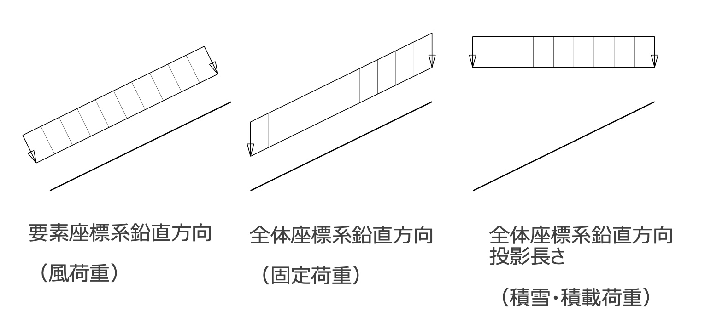

## 1.4. 設計目標

固定荷重Gと積雪荷重Sの組み合わせ荷重(G+S)において部材に生じる応力度が短期許容応力度以下、かつ部材の中央の変形がL/200以下とします。

## 1.5. 断面及び材料

断面寸法は各自選定してもらうこととしますが、以下に参考断面を示します。

O - 400 x 19（直径400mm、板厚19mmの円形鋼管）

( 断面積 A=227.4cm<sup>2</sup>, 断面係数Zy=2068cm<sup>3</sup>, 断面二次モーメントIy=41368cm<sup>4</sup> )

材料 400級（SN400 or STKN400）
( E=205000N/mm<sup>2</sup>, 短期許容応力度f=235N/mm<sup>2</sup> )

以下にコンポーネントの作成例を示します。これ以外にも様々な作成方法がありますので、各自検討してください。

# 2. Grasshopperによる描画

## 2.1. コンポーネントによる描画例

STEP1) Grasshopper上で円弧ACBを描画します。

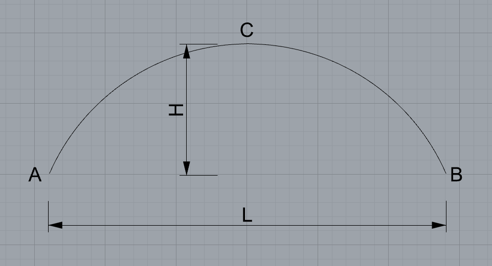

STEP2) 骨組解析では曲線の要素を解析することはできないので、円弧を分割して近似的に直線で表現することにします。今回は円弧ACBを20等分して節点位置を求め、各節点間を直線で結びます。

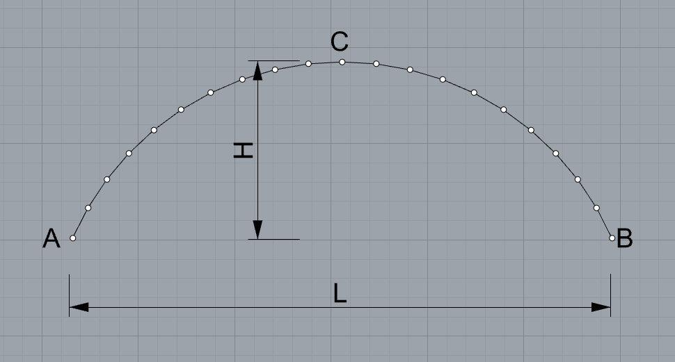

STEP3) 解析モデルの構築

節点はリストとして格納されていますので、i番目の節点とi+1番目の節点をつなげることが必要となります。

ここでは、二つの節点リスト(21個)を用意し、片方は最初の点（0番目）を削除し、もう一方は末尾の点（-1番目）を削除して、リスト同士を直線で結びます。

この直線が解析モデルにおける線材要素になります。

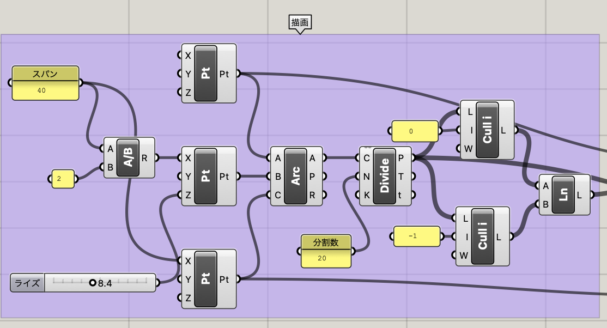
*コンポーネント配置による描画例*

## 2.2. ghPythonによる描画例

### 2.2.1. rhino-pythonの描画機能を用いて描画した場合

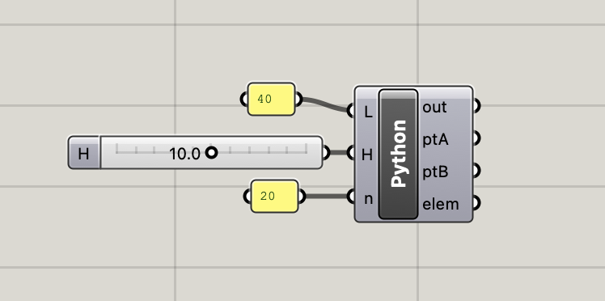

```python
import rhinoscriptsyntax as rs

# パネルから入力された文字列を数値に変換
# ※パネルを介して入力されると文字列として認識するために型の変換が必要
L = float(L)
n = int(n)

crdA = (0,   0, 10) # A点座標
crdB = (L,   0, 10) # B点座標
crdC = (L/2, 0, 10+H) # C点座標

# 円弧の描画
arc = rs.AddArc3Pt(crdA, crdB, crdC) 
# 円弧の分割(ptiは節点が格納されたリスト)
pti = rs.DivideCurve(arc, n) 

# 支点を設定するために始終端を取り出す。
ptA = pti[ 0] # 始端
ptB = pti[-1] # 終端（リストの最後は-1）

# 節点i-節点i+1を直線で結び、リストelemに格納
elem = []
for i in range( len(pti)-1 ):
    elem.append( rs.AddLine( pti[i], pti[i+1] ) )
```

### 2.2.2. 幾何計算による場合


1. 幾何条件L,hよりrを求める

   L<sup>2</sup>/4+(r-h)<sup>2</sup>=r<sup>2</sup> → r=(L<sup>2</sup>/4+h<sup>2</sup>)/2h
2. rcosα=L/2よりαを求める
3. π-2αをn等分してi番目の節点座標を求める

※原点を基点に計算しているので、y座標をr-h引く必要があります。

```python
import rhinoscriptsyntax as rs
import math

n = int(n) # nを整数に変換
L = float(L) # Lを実数に変換
r =  ( L**2/4 + H**2 ) / 2/H # 円弧の半径rを算出
ar = math.asin( (r-H)/r ) 
th = ( math.pi- 2*ar ) / n

# 円弧上の点の計算
pti = [] # 節点（ジオメトリ）を格納するリスト
for i in range(n+1):
    x = L / 2 - r *math.cos(ar + i*th) 
    z = r * math.sin(ar + i*th)- r + H
    pti.append(rs.AddPoint(x, 0, z))

ptA = pti[ 0] # 始端
ptB = pti[-1] # 終端（リストの最後は-1取り出せる）

# 線分の描画
elem = [] # 要素（ジオメトリ）を格納するリスト 
for i in range(n):
    elem.append(rs.AddLine(pti[i], pti[i+1]))
```

# 3. Karamba3Dによる解析

Karambaの各コンポーネントを接続して解析を実行し、My(y軸周り曲げモーメント)とNx(軸力)を図化してください。

ライズを調整することで部材に生じるMyやNxがどのように変化するか確認してください。
また、解析結果が想定と間違っていないか検証を行ってください。

以下はコンポーネントの接続例です。

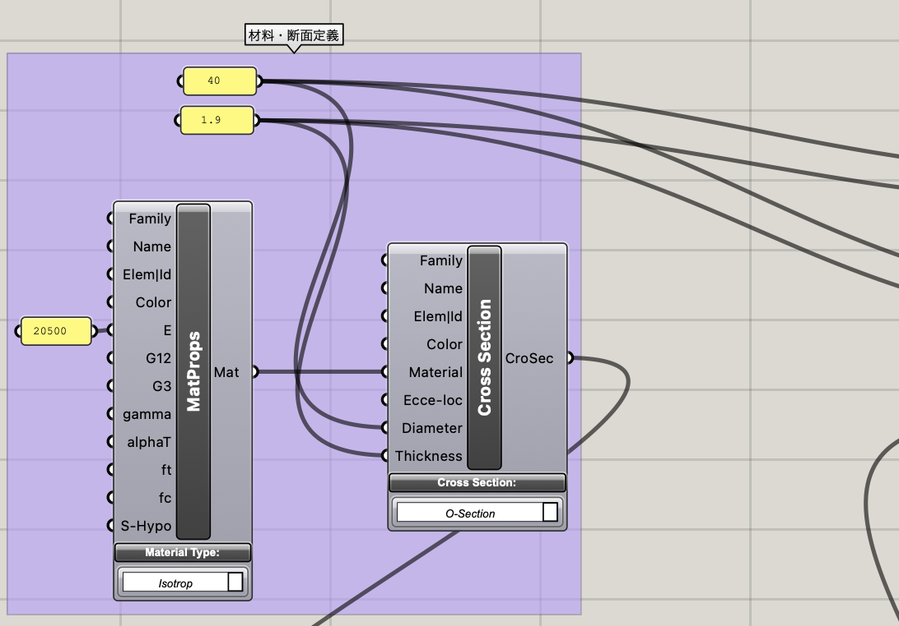

*断面・材料定義*

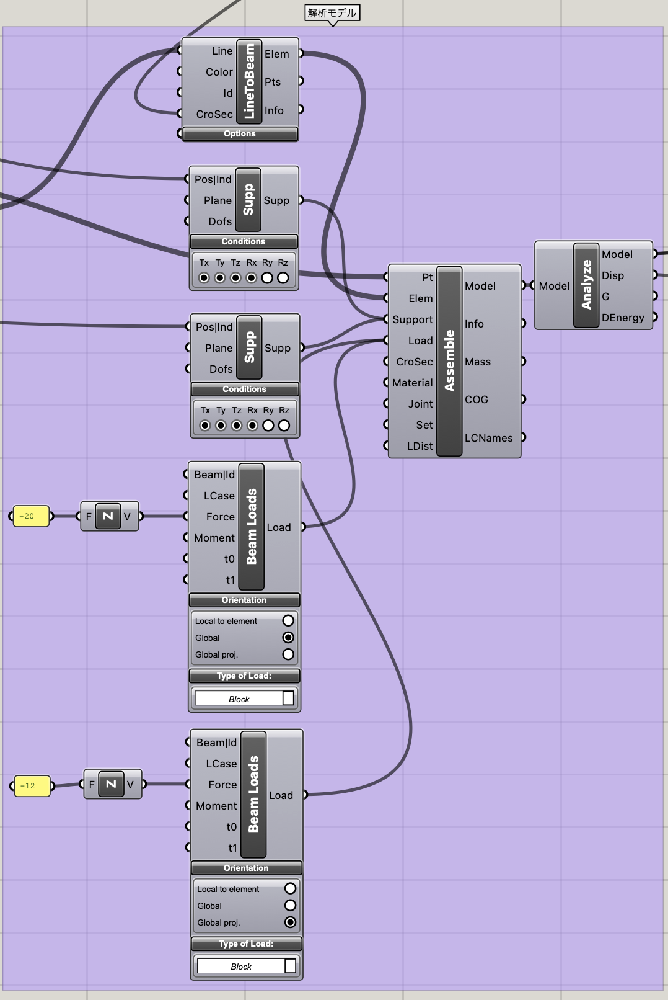

*解析部*

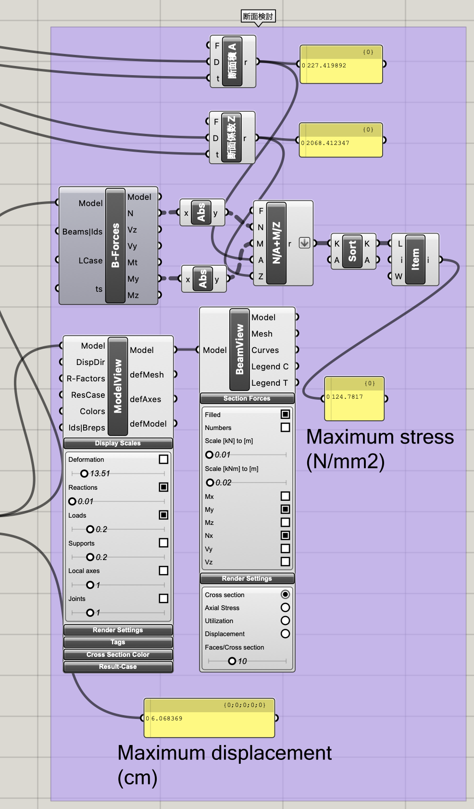

*応力度計算*

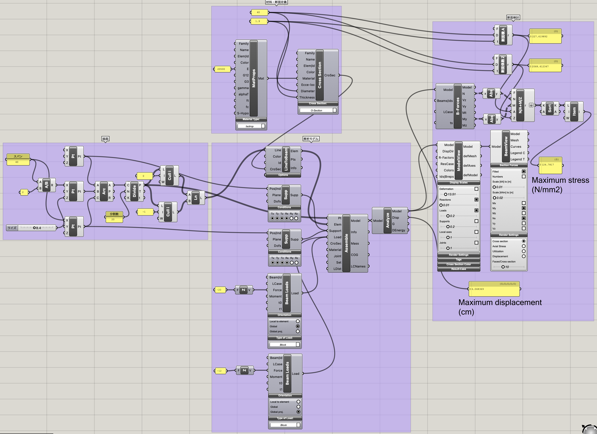

*コンポーネント全体図*

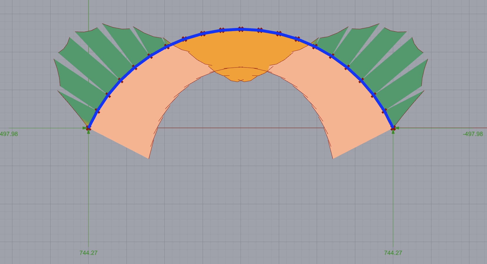

*出力例*


# 4. 断面性能の計算について

断面検討を行う際に、断面積や断面計数などの断面性能と呼ばれる数値が必要となります。

Karamba3DのCrossSectionで定義した断面はDissassemble CrossSectionで出力できます。Free版ではこの機能は使えませんので、代表的な断面性能の計算式を掲載しておきます。

+ 正方形角形鋼管（柱せい $D$ x 板厚 $t$ ）

```math
A  = D^2- (D-2t)^2
```

```math
I_y = \frac{ D^4 - (D-2t)^4 }{12}
```

```math
Z_y = I \cdot 2/D = \frac{ D^4 - (D-2t)^4 }{ 6D }
```

+ 円形鋼管（直径 $D$ x 板厚 $t$ ）

```math
A  = \pi  \frac{ D^2 - (D-2t)^2 }{4}
```

```math
I_y = \pi  \frac{D^4 - (D-2t)^4 }{64}
```

```math
Z_y = I \cdot 2/D  = \pi  \frac{ D^4 - (D-2t)^4 }{32D} 
```

+ H形鋼（梁せい $H$  x 梁幅 $B$ x ウェブ厚 $t_w$ x フランジ厚 $t_f$ ）

```math
A  = B\cdot D- (B -t_w)\cdot (D-2t_f)
```

```math
I_y = \frac{ B\cdot D^3 - (B -t_w)\cdot (D-2t_f)^3}{12}
```

```math
Z_y = I \cdot 2/D = \frac{ B\cdot D^3 - (B -t_w)\cdot (D-2t_f)^3 } {6D}
```

円形鋼管の場合、断面積と断面係数の計算例を示します。
evaluateコンポーネントで、Dとtを入力端子として設定し、以下のように計算式を入力します。

Maths　-> script -> Evaluate

断面積


断面係数


# 5. 最大応力度の計算

各要素に生じる応力度（単位面積当たりの力）は下式であらわされます。座屈を考慮する場合は、圧縮側と引張側それぞれで評価しますが、今回は検討を簡単にするために、軸力と曲げモーメントの絶対値で評価します。

<!--  -->
$$ \sigma = \frac{N}{A} + \frac{M}{Z}$$

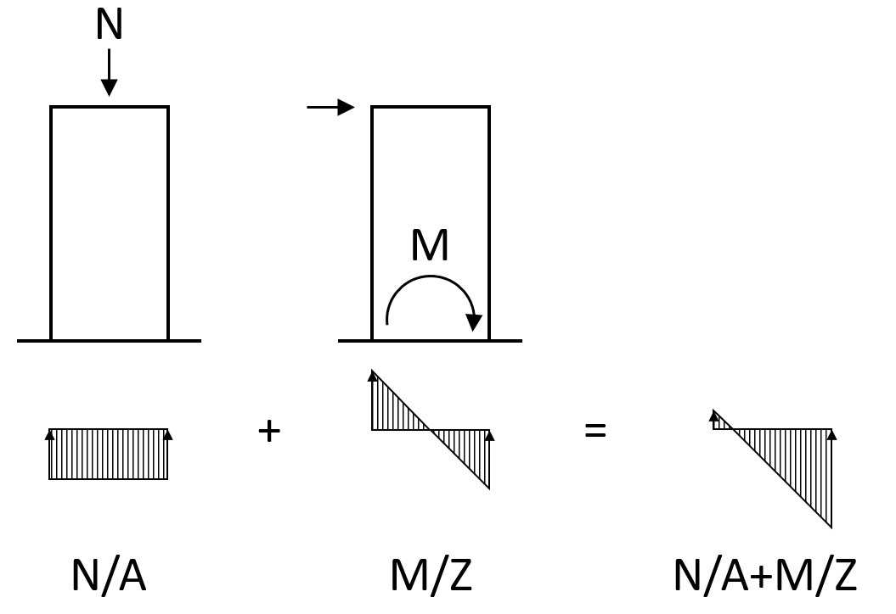

断面積A、断面性能Z、N/A+M/Zの計算はEvaluateコンポーネントに関数を定義して計算しています。

部材に生じる応力度N/A+M/Zの単位はN/mm<sup>2</sup>として出力します。短期許容応力度は235N/mm<sup>2</sup>となりますので、この許容応力度内にあることを確認します。


また、karambaで出力された軸力や曲げモーメントは階層構造のデータに格納されています。一つの線材要素には始端・終端の値が格納されており、さらに全要素の部材が格納されています。
要素毎の応力度が計算されたら、全ての要素の応力度の最大値を取り出すために、同じ階層にデータを並べます。
Evaluateコンポーネントの出力端子で右クリクリックし、Flattenの操作を行います。
sortコンポーネントで昇順に並び替えて、ListItemコンポーネントで末尾(-1番目)の値を抽出することで最大値を取得できます。
キャプチャ画面ではListItemコンポーネントのi端子にsetIntegerで-1を設定しています。Panelコンポーネントから-1を入力してもOKです。


# 6. パラメトリックスタディについて

number sliderでライズHを変更することにより、各要素に働く力や変形が変わっていくのが確認できると思います。応力度・最大変形量が最小になるライズを確認してください。

構造設計の基本設計では、どこに最適解があるかパラメータースタディを行なって架構の形態や部材断面を決定していくことがあります。
これまでは解析ソフトの数値を調整して解析を行うということを繰り返し行なっていましたので、grasshopperは画期的なツールと言えます。

## 6.1. 連番で並んだ画像を動画にする

GrasshopperのNumber Sliderはアニメーションを行うことが可能です。Number Sliderを右クリックしてアニメーションを選択、出力フォルダなどを指定します。ここで出力されるのは動画ファイルではなく、ファイル名が連番となった画像ファイルです。

これをPythonを使って動画にするコードを以下に示します。
google colabにimagesフォルダを作成し、そこに作成した画像ファイルをコピーします。
[colaboratory コード](https://colab.research.google.com/gist/Tatsuru-Mihashi/38499ef20b97987001857b957a471a00/gh_animation.ipynb?hl=ja)

```python
import glob
import cv2
# FPS(frames/second)の設定
fps = 10

# 画像ファイルの読み込み
img_array = []
for filename in sorted(glob.glob("images/*.bmp")):
    img = cv2.imread(filename)
    height, width, layers = img.shape
    size = (width, height)
    img_array.append(img)

# 出力ファイル名の設定
FN = 'animation.mp4'
```

## 6.2. Karambaで解析した結果をCSVに出力する

grasshopperのnumber sliderを使ってパラメトリックに状態を確認することは可能ですが、number sliderの各値に対する解析結果(最大応力度や最大変形など)のgrasshopper上のcanvasに保存されません。
GHPythonコンポーネントを使ってファイルに出力します。

以下はresult.csvとしてカンマ区切りのファイルを出力する例です。
コードをghpythonコンポーネント内に記述し、入力端子xにnumber sliderのライズ、v1に出力したい項目を接続してください。
また、FNに適切なファイルパスを設定してください。Desktopに設定すると操作が容易です。
コードを修正すれば複数の値を出力することも可能です。

このコンポーネントを設定したのちに、number sliderのアニメーションを再度実行します。

なお、numbersliderを動かすたびに出力され続けるので、最初から出力したい場合は、一旦出力されたcsvを削除します。

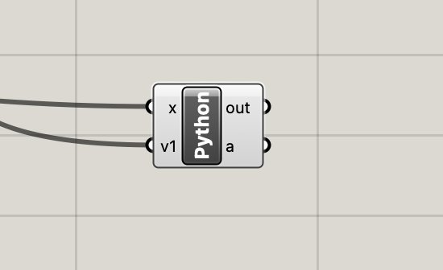

```python
import rhinoscriptsyntax as rs

# ファイルに値を出力
FN= "/*****/****/result.csv"  # ファイルパスを指定
with open(FN, "a") as file:
    file.write(str(x) + ',' + str(v1) + '\n')
```

## 6.3. 出力されたCSVファイルをグラフに出力する

先ほど出力したCSVファイルをグラフで確認します。
ここでは部材に生じる最大応力度がどのように変化するか確認します。

### 6.3.1. grasshopperによる出力
grasshopperのquick graphというコンポーネントによって作図します。
File Componentを配置し、右クリックでselect one exist fileをクリックし、出力したresult.csvを指定します。データはカンマ区切りの２列のデータで構成されていますので、TextSpritコンポーネントでカンマで分割し、1番目のデータを抽出します。
このquick graphコンポーネントは指定された値の推移を示すもので、パラメーターとの相関を示すものではないことに注意してください。

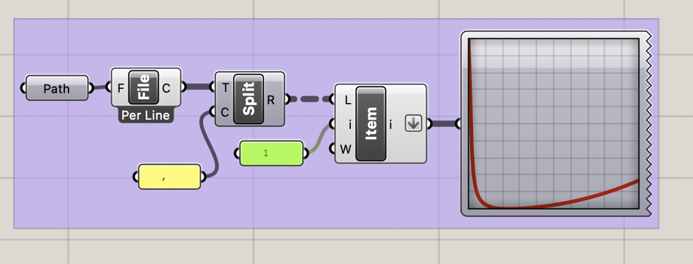
アーチを描画したように、canvas上に直接LINEコンポーネントで描画する方法もあります。

### 6.3.2. pandasによる出力
quickg raphコンポーネントでは、細かい操作ができないのでPythonのPandasライブラリを使って出力する場合について示します。
最大応力度についてv1を指定した場合、pandasを利用すると以下のようなコードで図化できます。

[colaboratory コード](https://colab.research.google.com/gist/Tatsuru-Mihashi/6b1469276b6e54753d7f946b24c273fc/gh_makegraph.ipynb)

```python
import pandas as pd # pandasのimport
# csvファイルの読み込み（ヘッダなし、indexは0列目の指定）
df = pd.read_csv('result.csv', header=None, index_col=0) 

df.plot()
# １列目の最小値を表示
df[1].min()
# １列目の最小値のindexを表示(最小値を取るときのxの値)
df[1].idxmin()
```

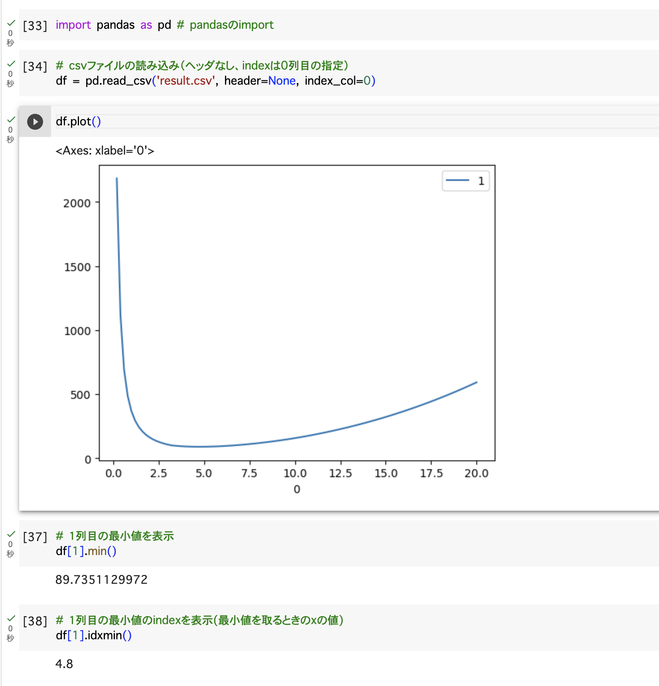

